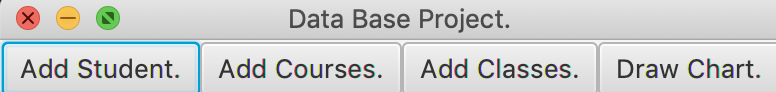
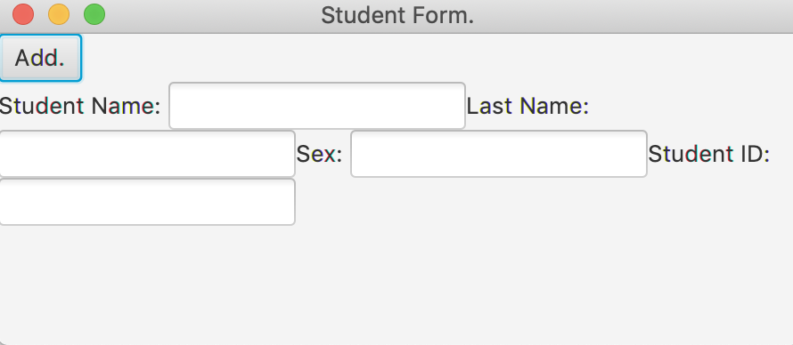
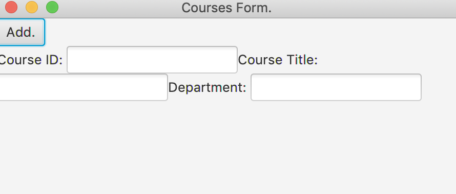
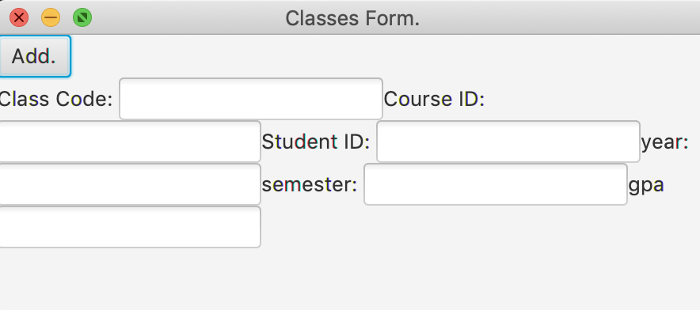

***CSC 221 Student Data Base Project***

When running the program you first see:

Lets you select whether you wanna add a student course or class:

Adding Student GUI:

Adding Course GUI:

Adding Classes GUI:

